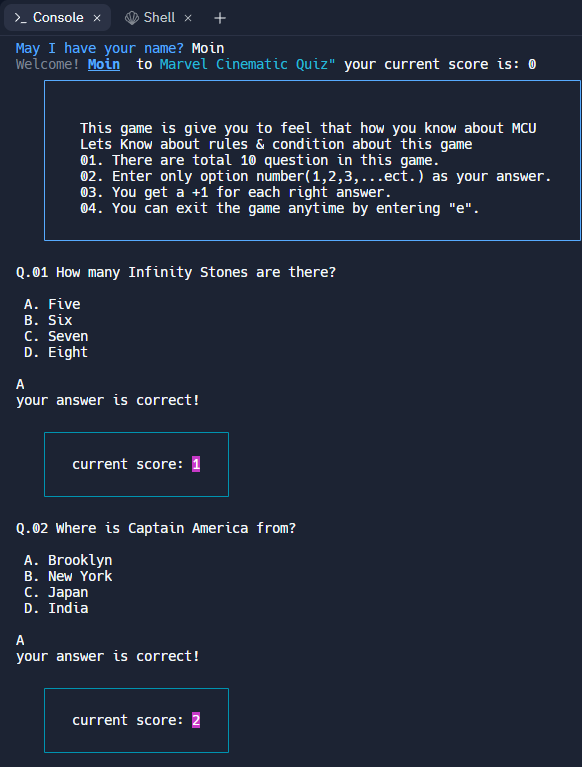
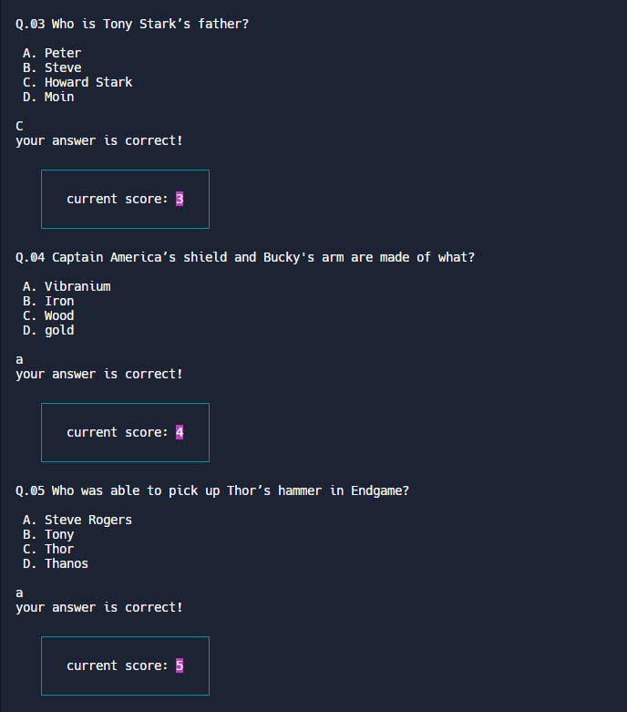
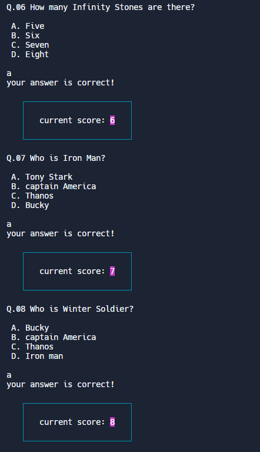
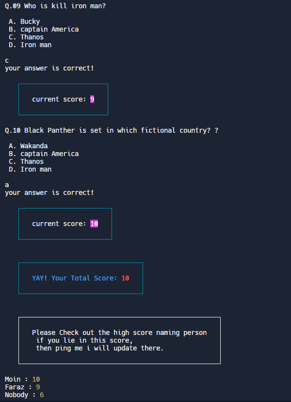

# Project name: Are You Marvel Fan?

  
 

Project Description:- In this project, I created a CLI (Command line Interface) App. Which is basically a quiz app bansed an information on MCU(Marvel Cinematic Universe). Through this, I find out how much you know abou marvel comics. 

# Information About project:- 

Details about project :- I use _**ReadlineSync**_ for user communication.
i use _**CHALK**_ for styling and color
I use _**Boxen**_ for created a box in this app.

[Link](https://replit.com/@mdmoinuddin3/Mark-2#index.jsembed=1&output=1)

1. This is basically a fun quiz app.
2. where is question about MCU comics.
3. if you know some question It, and if it is right then you gain marks.
4. if you don't know question which is about it then you gain nothing.
5. Every right answer marks = 1.
6. wrongh answer , marks = 0

For each correct answer you will be rewarded with 1 points and for incorrect answer you will lose Nothing.
So Don't worry, Just play & fun :)

In the end don't forget to checkout your final score out of 10 points.

# Tech stack

1. Javascript
2. readlinesync (for commuication and take input from user)
3. CHALK         (for colour text and styling)
4. Boxen         (for insert boxen)

## Screenshot:--

